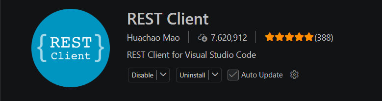

# Projeto Agente-ZAP 
 Criei esse projeto para praticar meu Python e ainda me ajudar nas tarefas do dia a dia.


## Para iniciar o projeto em ambiente linux rode
```bash
python3 -m venv .venv
source .venv/bin/activate
python -m pip install -r requirements.txt

```
---

## Para rodar no windows 
```bash
python -m venv .venv
# se for bash seu terminal no windows
source .venv/Scripts/activate  

# se o terminal for powershell e só
# .venv\Scripts\Activate.ps1

# se for CMD o seu terminal
# .venv\Scripts\activate.bat

python -m pip install -r requirements.txt   
```

### Copie a env e configure as variáveis
```bash
cp .env.example .env

```
### suba o container wuzapi
```bash
docker compose up -d

```

#### Rode o projeto
```bash
uvicorn app.main:app --reload

# Se a porta 8000 estiver ocupada, use outra:
uvicorn app.main:app --reload --port 8001
```
----


## Para testar o arquivo [res.http](reqs.http) utilize a extensão ([REST Client](https://marketplace.visualstudio.com/items?itemName=humao.rest-client))


---


---